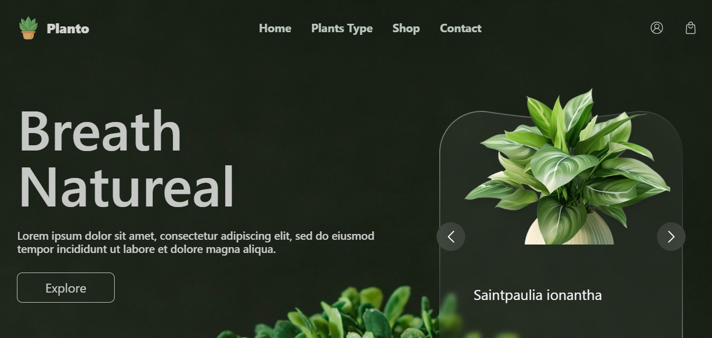
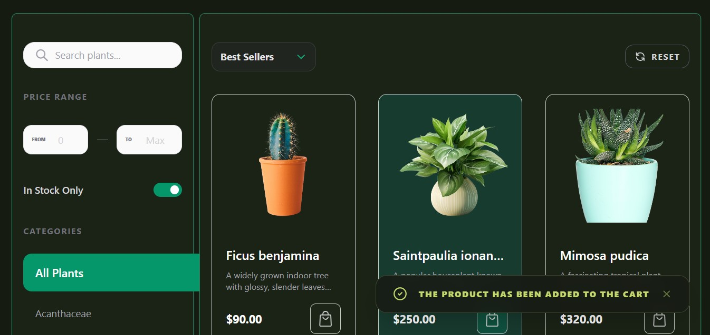
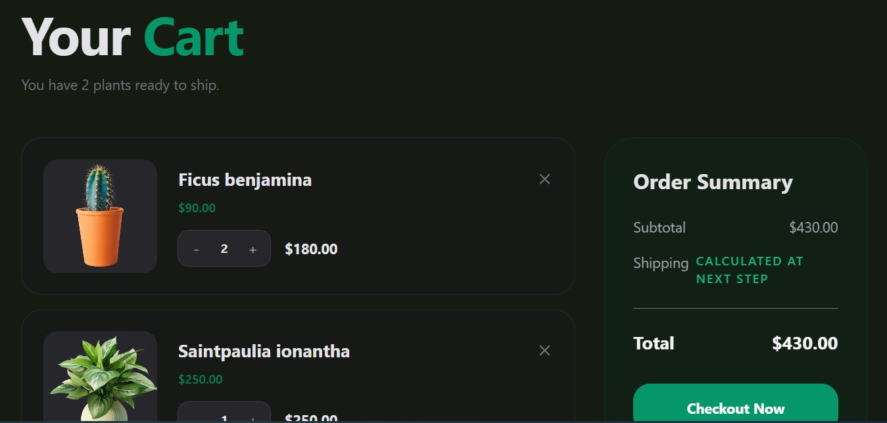
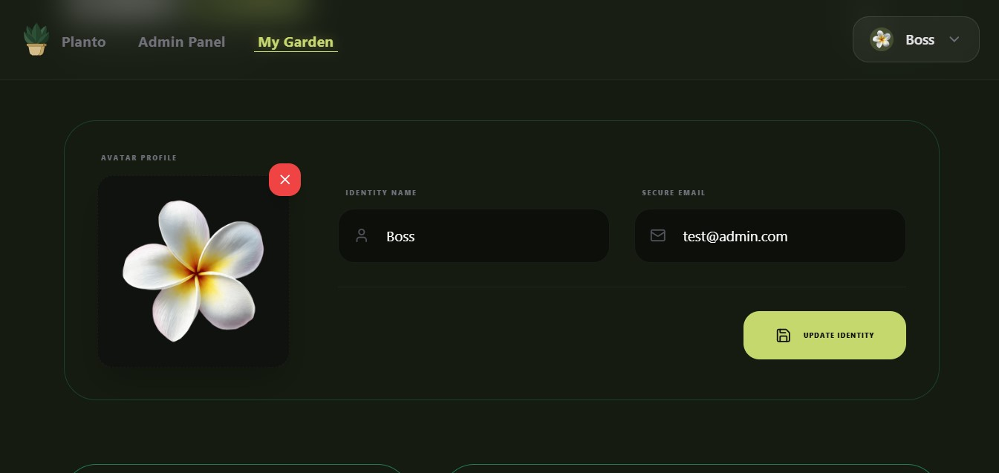
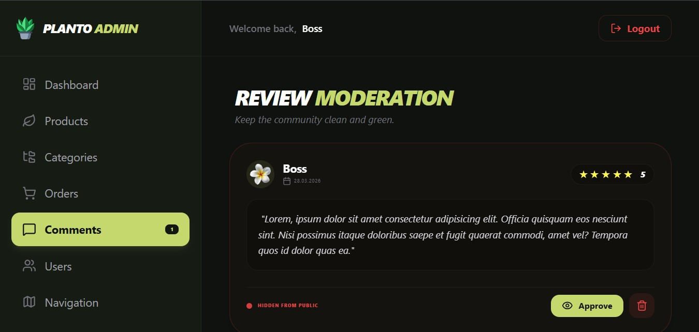
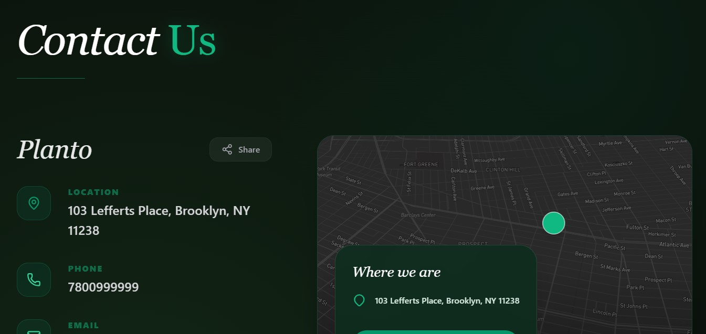

# PlantShop — E-commerce Shop for Plants

Pet project of an online houseplant store built with Laravel 12 + Vue 3 + Inertia.js (SSR).
Focus: database integrity, SEO, and a rich interactive UI.

---

## 📸 Demo


| Home                                      | Shop                                      | Cart                                      |
| ----------------------------------------- | ----------------------------------------- | ----------------------------------------- |
|  |  |  |

| Profile                                   | Admin                                       | Contact                                         |
| ----------------------------------------- | ------------------------------------------- | ----------------------------------------------- |
|  |  |  |

> No live demo yet — the project runs locally in a few minutes (see [Installation](#-installation)).

---

## 🛠 Tech Stack

**Backend**

- PHP 8.2+, Laravel 12
- Controllers · Services · Observers · Events/Listeners · Notifications
- PostgreSQL 14+
- Laravel Sanctum (API auth)
- Spatie Laravel Media Library
- Cloudinary (image storage)
- mews/purifier (HTML sanitization)

**Frontend**

- Vue 3 (Composition API) + TypeScript
- Inertia.js 2 with **SSR**
- Vite 7 (image optimization via `vite-imagetools` / `sharp`, legacy build)
- Tailwind CSS, Headless UI, Heroicons, Lucide
- GSAP · Swiper · VueUse · Mapbox GL · Howler · vuedraggable
- Ziggy (routes in JS)

**Quality**

- Pest 3 (Unit + Feature tests)
- Laravel Pint (PSR-12)
- Laravel Pail (dev logs)
- ESLint 9 + Prettier

**Integrations**

- Stripe Checkout — implemented, disabled by default
- Telegram Bot API — new-order notifications to admin
- Mailtrap (local email catch)

---

## ✨ Features

A condensed list — full breakdown in [docs/FEATURES.md](docs/FEATURES.md).

**Shop**

- Catalog with filters (type, price, light, pet-safety, difficulty), debounced search
- Product pages, reviews with moderation
- Cart stored in DB, synced on login
- Guest checkout with auto-registration
- **Overselling protection** — `lockForUpdate` on product rows during checkout
- **Atomic transactions** — order + stock decrement in a single DB transaction

**Accounts**

- User dashboard: order history, reviews
- Admin panel: orders, users, comments, chat, product photo uploads
- Notifications and emails triggered by order status changes (Laravel Events)
- Newsletter subscription

**Integrations**

- Telegram: new-order message to admin chat
- Stripe Checkout (see below)

**SEO**

- Inertia SSR
- Meta tags per controller (Open Graph + Twitter)
- Sitemap, robots.txt, canonical URLs
- Different logos per page type
- Full ARIA coverage

**UI / UX**

- Season-aware canvas animation (petals, leaves, snowflakes by user's season)
- Ambient sound landscape (Howler) with a toggle to disable animations/audio
- Mapbox map on Contacts
- Skeletons, loaders, toasts with **Undo**
- Drag & drop, snap scroll, smooth scroll, parallax, hover effects
- Client-side image compression + upload preview with drag & drop
- Real-time validation, floating labels, default avatar with the user's initial
- Next-gen image formats

### 💳 Payments (Stripe)

Stripe Checkout is implemented in `OrderController::store` but **disabled by default** via a `$skipStripe` flag — orders go straight to `processing` so checkout can be tested without real keys. To enable: set `$skipStripe = false` and provide `STRIPE_KEY` / `STRIPE_SECRET` in `.env`.

---

## 🚀 Installation

### Requirements

- PHP 8.2+, Composer 2
- Node.js 20+, npm
- PostgreSQL 14+
- (Optional) Stripe test keys
- (Optional) Telegram bot token + admin chat ID
- (Optional) Mapbox access token

### Steps

```bash
# 1. Clone
git clone https://github.com/Alexey96may/Planto-website-Laravel-Vue.git
cd Planto-website-Laravel-Vue

# 2. One-command setup
# (installs PHP + JS deps, copies .env, generates key, migrates, builds assets)
composer setup

# 3. Edit .env with your credentials:
#   DB_CONNECTION=pgsql
#   DB_HOST=127.0.0.1
#   DB_PORT=5432
#   DB_DATABASE=plant_shop
#   DB_USERNAME=postgres
#   DB_PASSWORD=your_password
#
#   CLOUDINARY_URL=cloudinary://...
#   TELEGRAM_BOT_TOKEN= / TELEGRAM_ADMIN_CHAT_ID=
#   STRIPE_KEY= / STRIPE_SECRET=
#   VITE_MAPBOX_TOKEN=
#   MAIL_* (Mailtrap, or MAIL_MAILER=log)

# 4. Run everything with a single command
composer dev
```

App: http://localhost:8000
Admin: http://localhost:8000/admin/dashboard

### Demo credentials

Created by seeders:

- **Email:** `test@admin.com`
- **Password:** `admin`

### Optional: SSR

```bash
npm run build
npm run ssr:run         # third terminal
```

SSR is optional for local development — the app works fine without it. It matters for SEO and first paint in production.

### Optional: Postgres via Docker

```yaml
services:
    db:
        image: postgres:16-alpine
        restart: unless-stopped
        ports:
            - '5432:5432'
        environment:
            POSTGRES_DB: plant_shop
            POSTGRES_USER: postgres
            POSTGRES_PASSWORD: secret
        volumes:
            - pgdata:/var/lib/postgresql/data

volumes:
    pgdata:
```

```bash
docker compose up -d db
# then in .env: DB_HOST=127.0.0.1, DB_PORT=5432, DB_PASSWORD=secret
```

---

## 🧪 Tests

```bash
npm run test:js     # Vitest
npm run test:php    # php artisan test (Unit + Feature)
npm test            # both
```

---

## 🗺 Roadmap

Short-term:

- [ ] Enable Stripe Checkout + `checkout.session.completed` webhook
- [ ] Promo codes and discounts
- [ ] Breadcrumbs, tags, wishlist
- [ ] Soft deletes for users / products / posts
- [ ] Dark mode + i18n
- [ ] S3 / Cloudinary storage
- [ ] Component & E2E tests (Vitest + Playwright)
- [ ] Laravel Pint in CI

Full list → [docs/ROADMAP.md](docs/ROADMAP.md)

---

## 👤 Author

**Aleksey Shulga** — Fullstack Developer
Laravel · Vue.js · TypeScript · Node.js
